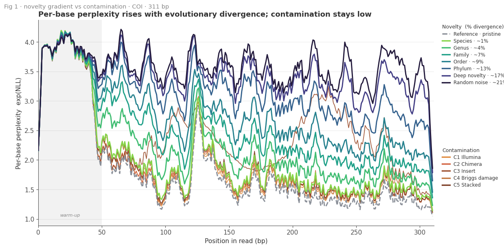
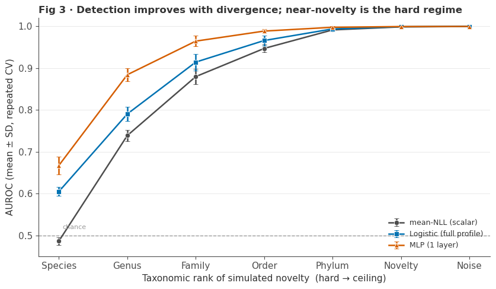

# Novelty vs. contamination in eDNA reads, from a genomic language model's per-base surprise

**[→ Read the full notebook, rendered](https://maiakaplan03.github.io/evo2-edna-novelty/)** — every
cell, all 8 figures, and the markdown explanations, as a static page (no Jupyter required).

**Can a DNA foundation model tell an unknown species from a broken read?**

When environmental-DNA (eDNA) metabarcoding returns a read that no reference database
can classify, that failure is ambiguous in a way that matters biologically. Either the
read is **real novelty** — an organism whose barcode is genuinely absent from the
reference set — or it is a **known organism whose read is damaged**: sequencing error,
a chimera of two amplicons, a foreign insert, degraded ancient DNA. The first case is a
discovery. The second is noise. Standard pipelines discard both.

This project asks whether the **per-base negative log-likelihood** that
[Evo2](https://github.com/ArcInstitute/evo2) (7B) assigns to a 313 bp COI barcode
carries enough signal to separate the two — and, if so, how much model capacity it takes
to extract it.

---

## The design

The core difficulty is that "hard to classify" is not a label you can collect in the
wild — you never know the ground truth for a real unknown read. So both classes are
**constructed**, which makes the labels exact:

**Novelty (positives)** is simulated as a *graded* series, not a binary. Reference COI
barcodes are evolved along a phylogeny with `pyvolve` to realized divergences that
correspond to a new **Species (~1%)**, **Genus (~4%)**, **Family (~7%)**, **Order (~9%)**,
**Phylum (~13%)**, plus a deep-novelty and a random-sequence anchor. This turns a yes/no
question into a **detectability curve**: at what evolutionary distance does the signal
appear?

**Contamination (negatives)** is five mechanisms applied to the *same* references:
Illumina error (C1), chimeras (C2), foreign inserts (C3), Briggs ancient-DNA damage at
three tiers (C4), and stacked artefacts (C5).

Because positives and negatives derive from a shared reference pool, a naive split leaks.
Two controls are enforced throughout:

- **Cluster-atomic cross-validation** — reads are grouped by reference sequence cluster, and
  a whole cluster lives in exactly one fold. Reads from one ancestor can never straddle
  the train/test boundary.
- **Label-collision removal** — where a simulated positive and a contaminated negative
  happen to produce a *byte-identical* sequence, the entire colliding group is dropped
  from evaluation (8 groups, 46 reads). An identical sequence cannot carry two labels.

Evaluation is **5 repeat seeds × 5 folds** (× 5 model seeds for the neural models), and
every number is reported as mean ± SD across replicates.

---

## Headline result

AUROC against the shared C1–C5 contamination pool (prevalence ≈ 5.8%):

| Divergence | mean NLL | std NLL | logistic (full profile) | tiny MLP |
|---|---|---|---|---|
| **Species (~1%)** | 0.486 ± 0.009 | 0.586 ± 0.015 | 0.605 ± 0.011 | **0.667 ± 0.021** |
| **Genus (~4%)**   | 0.739 ± 0.014 | 0.756 ± 0.019 | 0.790 ± 0.017 | **0.884 ± 0.016** |
| Family (~7%)      | 0.880 ± 0.018 | 0.712 ± 0.030 | 0.914 ± 0.020 | **0.965 ± 0.013** |
| Order (~9%)       | 0.947 ± 0.009 | 0.578 ± 0.033 | 0.966 ± 0.012 | **0.989 ± 0.005** |
| Phylum (~13%)     | 0.992 ± 0.003 | 0.278 ± 0.030 | 0.994 ± 0.006 | **0.998 ± 0.003** |
| Deep novelty      | 0.999 | 0.097 | 0.999 | 0.9995 |
| Random sequence   | 0.9998 | 0.031 | 0.9999 | 0.9998 |

Three things this says:

1. **The signal is real but it lives at the boundary.** From Family outward the problem is
   essentially solved by a single scalar. The interesting regime is Species and Genus,
   where novelty and contamination genuinely overlap in surprise-space.
2. **A single scalar is not enough at the hard end.** Mean NLL at Species is 0.486 —
   *below chance*. A near-novel read is not simply "more surprising" than a contaminated
   one; the two are comparably surprising, and averaging destroys what separates them.
3. **The information is in the shape of the profile, not its height.** Keeping all 311
   positions and adding non-linearity climbs Species 0.486 → 0.605 → 0.667 and Genus
   0.739 → 0.790 → 0.884. A depth ablation showed extra layers do *not* help further,
   which points at a signal-limited rather than a capacity-limited problem.

---

## Figures



*Fig 1 — per-base perplexity (`exp(NLL)`) along the 311-bp read, novelty gradient vs. the five
contamination mechanisms. Novelty pushes the whole profile up as divergence increases;
contamination stays near the reference baseline throughout.*



*Fig 3 — AUROC against the shared contamination pool, per taxonomic rank of simulated novelty.
Species and Genus are the informative regime; a single scalar (mean NLL) is at or below chance
there, and the full 311-position profile (logistic / MLP) is what recovers the signal.*

---

## What is in this repository

```
DL_project_handin_Kaplan_Maia.ipynb   read-only copy, all outputs saved
project_paper_Kaplan_Maia.pdf         the written report
figures/                              Fig 1 + Fig 3 as standalone PNGs (embedded above)
docs/                                 rendered notebook (GitHub Pages, static HTML)
reproducibility_files/
  notebooks/DL_project_handin_...ipynb  <- RUN THIS ONE (paths resolve from here)
  reference_code/                       4 modules the notebook imports
    curated_paths.py                      single source of truth for every path
    build_curated_splits.py               cluster-atomic CV construction
    master_paper_lib.py                   repeated-CV engine, models, metrics
    p1b_curated_v5_analysis.py            loaders + analysis driver
  data_generation/                      manifest, combined FASTA, reference set, splits
  lt_evo2_evo2_results_curated/         per_base.jsonl.gz — Evo2 per-base NLL profiles
  analysis_outputs/                     precomputed result CSVs
```

## Reproducing

```bash
git clone https://github.com/maiakaplan03/evo2-edna-novelty.git
cd evo2-edna-novelty
pip install numpy pandas matplotlib scikit-learn biopython torch
jupyter lab reproducibility_files/notebooks/DL_project_handin_Kaplan_Maia.ipynb   # Run All
```

- Run the copy **inside** `reproducibility_files/notebooks/`. It resolves every path
  relative to its own folder (`ROOT = notebook_dir/..`); the top-level copy is for reading.
- `biopython` is required — the notebook rebuilds the CV splits from the reference FASTA.
- `torch` is needed only to *retrain* the MLP/CNN. Without it those cells fall back to the
  saved CSVs in `analysis_outputs/master_paper/` and every figure still reproduces.
- Just want to read the results? Open the top-level notebook. All outputs are saved; nothing runs.

### Data

Everything needed is **in the repository** — no external download. The large inputs are
stored gzipped so the repo stays clonable:

| File | Raw | In repo |
|---|---|---|
| `per_base.jsonl` — 56,127 Evo2 per-base NLL profiles | 167 MB | **37 MB** |
| `phase1_all_curated_v5.fasta` — all reads + references | 24 MB | **2.1 MB** |
| `phase1_manifest.csv` — read → cohort → parent map | 5.2 MB | **0.5 MB** |

The loaders decompress transparently: `curated_paths._resolve()` prefers an uncompressed
file when one exists and falls back to its `.gz` twin, and `p1b_curated_v5_analysis._open_text()`
handles both. Nothing needs to be unpacked by hand, and decompression costs ~1.5 s.

---

## Status

Part of an ongoing Licenciatura thesis (UBA / IQUIBICEN). The work here is the completed
deep-learning phase; per-position localization of contamination breakpoints and an
embedding-based extension are in progress.

**Author:** Maia Kaplan
